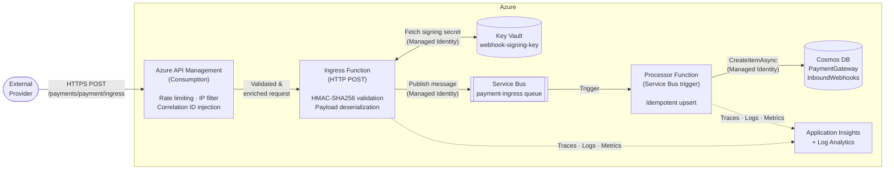

# Azure Payment Ingress Gateway

A high-scale, serverless payment webhook ingress gateway built with **.NET 9** and **Azure**. Designed to securely receive, validate, and durably process inbound payment events from external providers at scale — with zero connection strings, full observability, and infrastructure fully managed as code.

---

## Architecture



---

## Key Design Patterns

### Asynchronous Request-Reply
The Ingress Function returns **HTTP 202 Accepted** immediately after publishing the validated payload to Service Bus. The caller is not blocked on downstream processing. This decouples provider SLA requirements (fast ACK) from internal processing latency and enables independent scaling of ingress throughput vs. processing load.

### Idempotency
Every Cosmos DB document is keyed as `{provider}-{transactionId}` and written via `CreateItemAsync`. If the same webhook is delivered more than once (a common provider behaviour), the second write produces a **409 Conflict** which is caught, logged as a warning, and silently discarded — preventing duplicate payment records without requiring a separate deduplication store.

### Zero-Trust Security
No connection strings or secrets are stored in application configuration or source control. All service-to-service communication uses **Managed Identities** with **Azure RBAC**:

| Identity | Resource | Role |
|---|---|---|
| Ingress Function | Service Bus | Azure Service Bus Data Sender |
| Processor Function | Service Bus | Azure Service Bus Data Receiver |
| Ingress Function | Key Vault | Key Vault Secrets User |
| Ingress Function | Cosmos DB | (via endpoint, token credential) |
| Processor Function | Cosmos DB | (via endpoint, token credential) |

`DefaultAzureCredential` is used in both function apps, which transparently uses the system-assigned managed identity in Azure and the developer's `az login` session locally.

### Infrastructure as Code
Every Azure resource — Service Bus, Cosmos DB, Key Vault, Application Insights, API Management, Function Apps, Storage, and all RBAC assignments — is declared in modular **Azure Bicep** under `infra/`. There is no manual portal configuration. A single `az deployment group create` command provisions a complete, production-ready environment.

---

## Project Structure

```
azure-payment-ingress-gateway/
├── infra/
│   ├── main.bicep                  # Orchestration entry point
│   ├── main.bicepparam             # Default dev parameters
│   ├── policies/
│   │   └── payment-ingress-policy.xml  # APIM inbound policy
│   └── modules/
│       ├── apim.bicep              # API Management + backend + policy
│       ├── cosmosdb.bicep          # Cosmos DB (Serverless)
│       ├── functions.bicep         # Function Apps + Storage + RBAC
│       ├── keyvault.bicep          # Key Vault (RBAC mode)
│       ├── observability.bicep     # Log Analytics + Application Insights
│       └── servicebus.bicep        # Service Bus + queue
└── src/
    ├── AzurePaymentGateway.sln
    ├── Shared/
    │   └── Models/
    │       └── PaymentWebhookPayload.cs
    ├── Ingress.Function/
    │   ├── Functions/
    │   │   └── PaymentIngressFunction.cs   # HMAC validation + SB publish
    │   └── Program.cs                      # ServiceBusClient + SecretClient DI
    └── Processor.Function/
        ├── Functions/
        │   └── PaymentProcessorFunction.cs # Idempotent Cosmos DB write
        └── Program.cs                      # CosmosClient DI
```

---

## Prerequisites

| Tool | Version | Install |
|---|---|---|
| .NET SDK | 9.0+ | https://dot.net/download |
| Azure CLI | 2.60+ | https://aka.ms/installazurecli |
| Azure Functions Core Tools | v4 | `npm i -g azure-functions-core-tools@4` |
| Bicep CLI | latest | `az bicep install` |

---

## Deployment

### 1. Login and set subscription

```bash
az login
az account set --subscription "<your-subscription-id>"
```

### 2. Create a resource group

```bash
az group create \
  --name rg-payment-gateway-dev \
  --location eastus
```

### 3. Deploy infrastructure

```bash
az deployment group create \
  --resource-group rg-payment-gateway-dev \
  --template-file infra/main.bicep \
  --parameters infra/main.bicepparam \
  --parameters apimPublisherEmail="your@email.com" \
  --name payment-gateway-deploy
```

### 4. Store the HMAC signing secret in Key Vault

```bash
KV_NAME=$(az deployment group show \
  --resource-group rg-payment-gateway-dev \
  --name payment-gateway-deploy \
  --query properties.outputs.keyVaultUri.value -o tsv | sed 's|https://||;s|/||')

az keyvault secret set \
  --vault-name "$KV_NAME" \
  --name "webhook-signing-key" \
  --value "<your-provider-shared-secret>"
```

### 5. Deploy function apps

```bash
# Ingress
dotnet publish src/Ingress.Function -c Release -o ./publish/ingress
INGRESS_APP=$(az deployment group show \
  --resource-group rg-payment-gateway-dev \
  --name payment-gateway-deploy \
  --query properties.outputs.ingressFunctionAppName.value -o tsv)
az functionapp deployment source config-zip \
  --resource-group rg-payment-gateway-dev \
  --name "$INGRESS_APP" \
  --src <(cd ./publish/ingress && zip -r - .)

# Processor
dotnet publish src/Processor.Function -c Release -o ./publish/processor
PROCESSOR_APP=$(az deployment group show \
  --resource-group rg-payment-gateway-dev \
  --name payment-gateway-deploy \
  --query properties.outputs.processorFunctionAppName.value -o tsv)
az functionapp deployment source config-zip \
  --resource-group rg-payment-gateway-dev \
  --name "$PROCESSOR_APP" \
  --src <(cd ./publish/processor && zip -r - .)
```

---

## Local Development

### 1. Authenticate

```bash
az login
```

`DefaultAzureCredential` will pick up your `az login` session automatically.

### 2. Create `local.settings.json` in each function project

**`src/Ingress.Function/local.settings.json`**
```json
{
  "IsEncrypted": false,
  "Values": {
    "AzureWebJobsStorage": "UseDevelopmentStorage=true",
    "FUNCTIONS_WORKER_RUNTIME": "dotnet-isolated",
    "ServiceBusConnection__fullyQualifiedNamespace": "<your-sb-namespace>.servicebus.windows.net",
    "KeyVaultUri": "https://<your-kv-name>.vault.azure.net/"
  }
}
```

**`src/Processor.Function/local.settings.json`**
```json
{
  "IsEncrypted": false,
  "Values": {
    "AzureWebJobsStorage": "UseDevelopmentStorage=true",
    "FUNCTIONS_WORKER_RUNTIME": "dotnet-isolated",
    "ServiceBusConnection__fullyQualifiedNamespace": "<your-sb-namespace>.servicebus.windows.net",
    "CosmosDbEndpoint": "https://<your-cosmos-account>.documents.azure.com:443/"
  }
}
```

### 3. Run locally

```bash
cd src/Ingress.Function && func start
cd src/Processor.Function && func start
```

### 4. Send a test webhook

```bash
# Compute HMAC-SHA256 signature
SECRET="your-signing-secret"
BODY='{"transactionId":"txn_001","amount":99.99,"currency":"USD","status":"captured","timestamp":"2026-03-12T10:00:00Z","provider":"stripe"}'
SIG="sha256=$(echo -n "$BODY" | openssl dgst -sha256 -hmac "$SECRET" | awk '{print $2}')"

curl -X POST http://localhost:7071/api/payment/ingress \
  -H "Content-Type: application/json" \
  -H "X-Signature: $SIG" \
  -d "$BODY"
# Expected: HTTP 202 Accepted
```

---

## Security Considerations

- **HMAC validation** is performed before any deserialization, preventing payload injection from unauthenticated sources.
- **Constant-time comparison** (`CryptographicOperations.FixedTimeEquals`) is used when comparing signatures to prevent timing attacks.
- **IP filtering** in the APIM policy should be updated with real provider CIDR ranges before production deployment.
- **Soft-delete** is enabled on Key Vault with a 90-day retention window.
- All resources enforce **TLS 1.2 minimum** and have HTTPS-only access.
- `local.settings.json` is excluded from source control via `.gitignore`.
